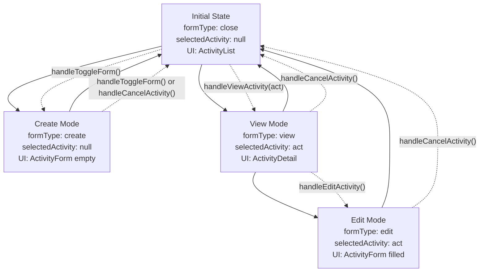

# State Flow Diagram - App.tsx

## State Variables
- `formType: FormType` - Controls which UI component is displayed
- `selectedActivity: Activity | null` - Holds the currently selected activity data

## FormType Values
- `"close"` - Default state, shows only ActivityList
- `"create"` - Shows ActivityForm in create mode (empty form)
- `"view"` - Shows ActivityDetail with selected activity
- `"edit"` - Shows ActivityForm in edit mode (pre-filled form)

## State Transitions

### Initial State
```
formType: "close"
selectedActivity: null
UI: ActivityList only
```

### 1. Create Activity Flow
**Trigger**: Click "Create Activity" button in NavBar
**Handler**: `handleToggleForm()`

```
FROM: formType: "close", selectedActivity: null
TO:   formType: "create", selectedActivity: null
UI:   Shows ActivityForm (empty, create mode)
```

**Cancel Create**: Click "Cancel activity" in NavBar or "Cancel" in form
```
FROM: formType: "create", selectedActivity: null  
TO:   formType: "close", selectedActivity: null
UI:   Back to ActivityList only
```

### 2. View Activity Flow
**Trigger**: Click "View" button on ActivityCard
**Handler**: `handleViewActivity(act)`

```
FROM: formType: "close", selectedActivity: null
TO:   formType: "view", selectedActivity: act
UI:   Shows ActivityDetail with activity data
```

### 3. Edit Activity Flow
**Trigger**: Click "Edit" button in ActivityDetail
**Handler**: `handleEditActivity()`

```
FROM: formType: "view", selectedActivity: act
TO:   formType: "edit", selectedActivity: act (preserved)
UI:   Shows ActivityForm (pre-filled, edit mode)
```

### 4. Cancel Operations
**Trigger**: Click "Cancel" button in ActivityDetail or ActivityForm
**Handler**: `handleCancelActivity()` or `handleCancelEdit()`

**Cancel from Create Mode**:
```
FROM: formType: "create", selectedActivity: null
TO:   formType: "close", selectedActivity: null
UI:   Back to ActivityList only
```

**Cancel from View Mode**:
```
FROM: formType: "view", selectedActivity: act
TO:   formType: "close", selectedActivity: null
UI:   Back to ActivityList only
```

**Cancel from Edit Mode** (NEW BEHAVIOR):
```
FROM: formType: "edit", selectedActivity: act
TO:   formType: "view", selectedActivity: act (preserved)
UI:   Back to ActivityDetail with same activity
```

## State Transition Diagram



## UI Components by State

| formType | selectedActivity | UI Component | Form State |
|----------|------------------|--------------|------------|
| `"close"` | `null` | ActivityList only | - |
| `"create"` | `null` | ActivityList + ActivityForm | Empty form, "Create activity" title |
| `"view"` | `Activity` | ActivityList + ActivityDetail | Shows activity data |
| `"edit"` | `Activity` | ActivityList + ActivityForm | Pre-filled form, "Edit activity" title |

## Handler Functions

### `handleToggleForm()`
- **Purpose**: Toggle between create mode and closed state
- **Logic**: `formType === "create" ? "close" : "create"`
- **Side Effect**: Always clears `selectedActivity` to `null`

### `handleViewActivity(act: Activity)`
- **Purpose**: View specific activity details
- **Logic**: Sets `selectedActivity` to passed activity, `formType` to "view"

### `handleEditActivity()`
- **Purpose**: Switch from view mode to edit mode
- **Logic**: Sets `formType` to "edit", preserves `selectedActivity`
- **Prerequisite**: Must be called from view mode with selected activity

### `handleCancelActivity()`
- **Purpose**: Return to default state from any mode
- **Logic**: Sets `formType` to "close", clears `selectedActivity` to `null`
- **Usage**: Universal cancel handler for all forms/views

## Key Design Patterns

1. **Single Source of Truth**: All UI state controlled by two variables
2. **Predictable Transitions**: Each handler has clear, single responsibility
3. **Data Preservation**: Edit mode preserves `selectedActivity` for form pre-filling
4. **Universal Cancel**: One handler resets to default state from anywhere
5. **Conditional Rendering**: UI components render based on state combination 